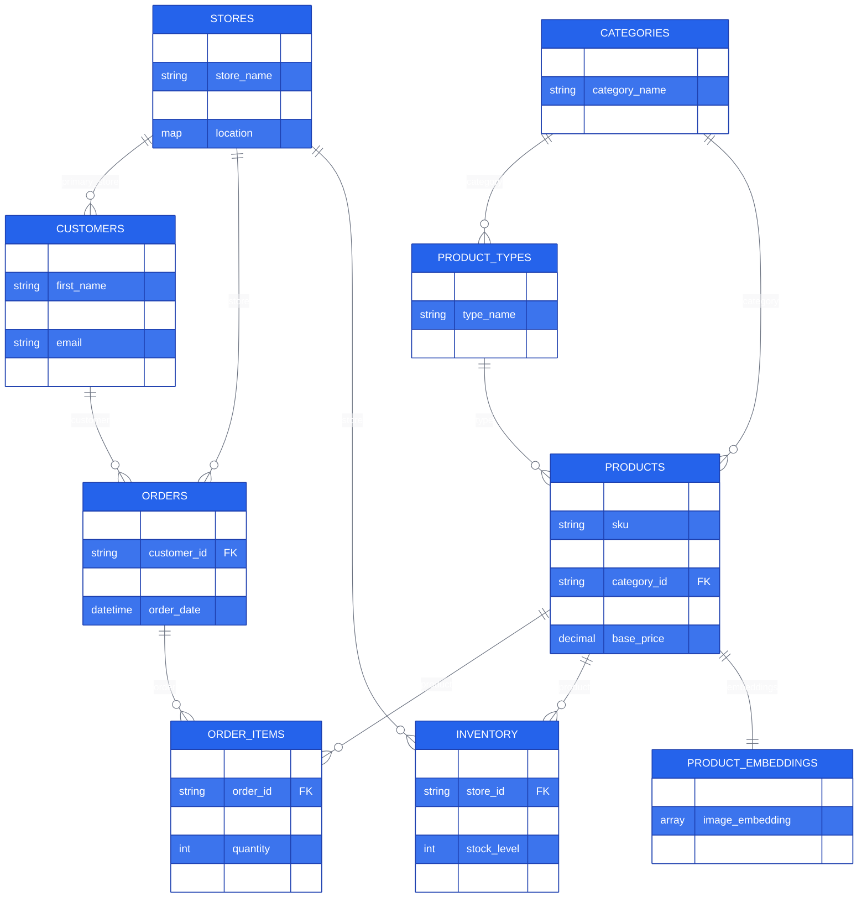

# Zava DIY Retail - MongoDB + Ditto Data Model

This document provides a complete specification of the data model for the Zava DIY Retail application, designed for MongoDB Atlas with Ditto edge sync capabilities.

---

## Table of Contents
1. [Overview](#overview)
2. [Design Principles](#design-principles)
3. [Collections](#collections)
4. [Relationships](#relationships)
5. [CRDT Considerations](#crdt-considerations)
6. [Ditto Connector ID Mappings](#ditto-connector-id-mappings)
7. [Indexes](#indexes)
8. [Document Size Estimates](#document-size-estimates)
9. [Query Patterns](#query-patterns)

---

## Overview

### Database Information
- **Database Name**: `zava`
- **Total Collections**: 9 (8 synced to Ditto, 1 MongoDB-only)
- **Total Documents**: ~453,000
- **Storage Size**: ~243 MB (MongoDB), ~236 MB (Ditto without embeddings)

### Collection Summary

| Collection | Documents | Avg Size | Synced to Ditto |
|------------|-----------|----------|-----------------|
| stores | 8 | 500 B | ✅ Yes |
| customers | 50,000 | 300 B | ✅ Yes |
| categories | 9 | 400 B | ✅ Yes |
| product_types | ~30 | 200 B | ✅ Yes |
| products | 400 | 1-2 KB | ✅ Yes |
| **product_embeddings** | 400 | 16-20 KB | ❌ **No** |
| inventory | ~3,000 | 200 B | ✅ Yes |
| orders | 200,000 | 500 B | ✅ Yes |
| order_items | 200,000-500,000 | 300 B | ✅ Yes |

---

## Design Principles

### 1. CRDT Compatibility
- **No arrays for concurrent updates**: Arrays are REGISTER types (last-write-wins)
- **Use MAPs instead**: Each key-value pair merges independently
- **Separate collections**: Order items as separate docs, not embedded arrays

### 2. Mobile-First
- **Small documents**: <2KB typical, <100KB max
- **Separate embeddings**: Large vectors (16-20KB) stored separately, not synced to mobile
- **Denormalized fields**: Include frequently accessed data to reduce joins

### 3. Ditto Connector Requirements
- **Duplicate ID fields**: ID fields duplicated in document body for queries
- **Immutable IDs**: All ID fields must never change
- **Top-level fields only**: ID mapping uses only top-level fields
- **Soft deletes**: Use `deleted: true` flag instead of removing documents

### 4. Data Integrity
- **Foreign keys**: Referenced IDs validated during generation
- **UUIDs**: Used for order_items (simple, no sequence management)
- **Composite IDs**: Used for inventory (natural key: store + product)
- **Required fields**: All documents have core required fields

---

## Collections

### 1. stores

**Purpose**: Store location management with multi-tenant access control

**Collection Name**: `stores`

**Document Structure**:
```json
{
  "_id": "store_seattle",
  "store_id": "store_seattle",
  "store_name": "Zava Retail Seattle",
  "rls_user_id": "f47ac10b-58cc-4372-a567-0e02b2c3d479",
  "is_online": false,
  "location": {
    "address": "123 Main St",
    "city": "Seattle",
    "state": "WA",
    "zip": "98101",
    "latitude": 47.6062,
    "longitude": -122.3321
  },
  "created_at": "2024-01-15T10:30:00Z",
  "deleted": false
}
```

**Field Definitions**:

| Field | Type | Required | Description |
|-------|------|----------|-------------|
| `_id` | string | Yes | MongoDB primary key (same as store_id) |
| `store_id` | string | Yes | Business identifier (duplicated for Ditto) |
| `store_name` | string | Yes | Display name of store |
| `rls_user_id` | string (UUID) | Yes | Row-level security identifier for multi-tenancy |
| `is_online` | boolean | Yes | True if online store, false for physical location |
| `location` | object (MAP) | Yes | Physical location details |
| `location.address` | string | Yes | Street address |
| `location.city` | string | Yes | City name |
| `location.state` | string | Yes | State abbreviation (e.g., "WA") |
| `location.zip` | string | Yes | ZIP code |
| `location.latitude` | number | No | GPS latitude |
| `location.longitude` | number | No | GPS longitude |
| `created_at` | string (ISO8601) | Yes | Store creation timestamp |
| `deleted` | boolean | Yes | Soft delete flag (always false for active) |

**Business Rules**:
- Store names must be unique
- RLS user IDs map to Ditto permissions
- Location is a MAP (CRDT-friendly, fields update independently)
- Seattle and Online stores are highest volume (3.0x multiplier)

**Document Count**: 8 stores total
- 7 physical stores in Washington State
- 1 online store

**Example Stores**:
- Zava Retail Seattle
- Zava Retail Bellevue
- Zava Retail Tacoma
- Zava Retail Spokane
- Zava Retail Olympia
- Zava Retail Vancouver
- Zava Retail Everett
- Zava Retail Online

---

### 2. customers

**Purpose**: Customer demographic and contact information

**Collection Name**: `customers`

**Document Structure**:
```json
{
  "_id": ObjectId("507f1f77bcf86cd799439011"),
  "customer_id": "cust_a1b2c3d4",
  "first_name": "John",
  "last_name": "Smith",
  "email": "john.smith@email.com",
  "phone": "(206) 555-0123",
  "primary_store_id": "store_seattle",
  "created_at": "2024-03-15T10:30:00Z",
  "updated_at": "2024-11-20T14:22:00Z",
  "deleted": false
}
```

**Field Definitions**:

| Field | Type | Required | Description |
|-------|------|----------|-------------|
| `_id` | ObjectId | Yes | MongoDB auto-generated primary key |
| `customer_id` | string | Yes | Business identifier (mapped to Ditto _id) |
| `first_name` | string | Yes | Customer first name |
| `last_name` | string | Yes | Customer last name |
| `email` | string | Yes | Email address (unique) |
| `phone` | string | Yes | Phone in format (XXX) XXX-XXXX |
| `primary_store_id` | string | Yes | FK → stores.store_id |
| `created_at` | string (ISO8601) | Yes | Account creation timestamp |
| `updated_at` | string (ISO8601) | Yes | Last update timestamp |
| `deleted` | boolean | Yes | Soft delete flag |

**Business Rules**:
- Email addresses must be unique
- Phone numbers formatted consistently: (XXX) XXX-XXXX
- Customers distributed by store weight (Seattle 30%, Bellevue 25%, Online 30%)
- Generated using Faker library for realistic names/emails

**Foreign Keys**:
- `primary_store_id` → `stores.store_id`

**Document Count**: ~50,000 customers

---

### 3. categories

**Purpose**: Top-level product categorization with seasonal patterns

**Collection Name**: `categories`

**Document Structure**:
```json
{
  "_id": "cat_power_tools",
  "category_id": "cat_power_tools",
  "category_name": "Power Tools",
  "seasonal_multipliers": {
    "jan": 0.8,
    "feb": 0.9,
    "mar": 1.2,
    "apr": 1.5,
    "may": 1.8,
    "jun": 2.0,
    "jul": 2.1,
    "aug": 1.7,
    "sep": 1.3,
    "oct": 1.1,
    "nov": 0.9,
    "dec": 1.0
  },
  "deleted": false
}
```

**Field Definitions**:

| Field | Type | Required | Description |
|-------|------|----------|-------------|
| `_id` | string | Yes | MongoDB primary key (same as category_id) |
| `category_id` | string | Yes | Business identifier |
| `category_name` | string | Yes | Display name (unique) |
| `seasonal_multipliers` | object (MAP) | Yes | Monthly demand multipliers (jan-dec keys) |
| `deleted` | boolean | Yes | Soft delete flag |

**Seasonal Multipliers**:
- **MAP not array** (CRDT-friendly!)
- Each month (jan-dec) is an independent key
- Values represent seasonal demand (1.0 = baseline)
- Used during order generation to model realistic patterns

**Categories** (9 total):
1. Hand Tools
2. Power Tools (peak: June-July 2.0-2.1x)
3. Paint & Finishes (peak: April 2.2x)
4. Hardware
5. Lumber & Building Materials (peak: June-July 2.1-2.2x)
6. Electrical
7. Plumbing
8. Garden & Outdoor (winter: 0.5x)
9. Storage & Organization

**Document Count**: 9 categories

---

### 4. product_types

**Purpose**: Sub-categorization within main categories

**Collection Name**: `product_types`

**Document Structure**:
```json
{
  "_id": "type_drills",
  "type_id": "type_drills",
  "type_name": "Drills",
  "category_id": "cat_power_tools",
  "deleted": false
}
```

**Field Definitions**:

| Field | Type | Required | Description |
|-------|------|----------|-------------|
| `_id` | string | Yes | MongoDB primary key |
| `type_id` | string | Yes | Business identifier |
| `type_name` | string | Yes | Display name |
| `category_id` | string | Yes | FK → categories.category_id |
| `deleted` | boolean | Yes | Soft delete flag |

**Foreign Keys**:
- `category_id` → `categories.category_id`

**Document Count**: ~30 product types

---

### 5. products

**Purpose**: Complete product catalog with pricing and specifications

**Collection Name**: `products`

**Document Structure**:
```json
{
  "_id": "prod_pwr_drill_001",
  "product_id": "prod_pwr_drill_001",
  "sku": "PWR-DRILL-001",
  "product_name": "20V Cordless Drill",
  "category_id": "cat_power_tools",
  "type_id": "type_drills",
  "cost": 100.00,
  "base_price": 149.99,
  "gross_margin_percent": 33.00,
  "product_description": "Professional grade cordless drill with 20V lithium-ion battery. Features variable speed trigger, LED work light, and comfortable grip. Includes charger and carrying case.",
  "image_url": "/images/drill.jpg",
  "specifications": {
    "voltage": "20V",
    "battery_type": "Lithium-Ion",
    "chuck_size": "0.5 inch",
    "weight_lbs": 3.5,
    "warranty_years": 3
  },
  "created_at": "2024-01-15T10:30:00Z",
  "updated_at": "2024-11-20T14:22:00Z",
  "deleted": false
}
```

**Field Definitions**:

| Field | Type | Required | Description |
|-------|------|----------|-------------|
| `_id` | string | Yes | MongoDB primary key |
| `product_id` | string | Yes | Business identifier (mapped to Ditto _id) |
| `sku` | string | Yes | Stock Keeping Unit (unique) |
| `product_name` | string | Yes | Display name |
| `category_id` | string | Yes | FK → categories.category_id |
| `type_id` | string | No | FK → product_types.type_id |
| `cost` | number | Yes | Wholesale cost (Decimal128 or float) |
| `base_price` | number | Yes | Retail selling price |
| `gross_margin_percent` | number | Yes | Margin percentage (always 33.00) |
| `product_description` | string | Yes | Detailed product description |
| `image_url` | string | No | Path to product image |
| `specifications` | object (MAP) | No | Product specifications |
| `created_at` | string (ISO8601) | Yes | Product creation timestamp |
| `updated_at` | string (ISO8601) | Yes | Last update timestamp |
| `deleted` | boolean | Yes | Soft delete flag |

**Business Rules**:
- SKU must be unique
- Pricing: `base_price = cost / 0.67` (33% margin)
- Specifications stored as MAP (CRDT-friendly)
- **Embeddings stored in separate collection** (not included here)

**Foreign Keys**:
- `category_id` → `categories.category_id`
- `type_id` → `product_types.type_id`

**Document Count**: 400 products

---

### 6. product_embeddings

**Purpose**: AI vector embeddings for semantic search (MongoDB only, NOT synced to Ditto)

**Collection Name**: `product_embeddings`

**Document Structure**:
```json
{
  "_id": "prod_pwr_drill_001",
  "product_id": "prod_pwr_drill_001",
  "image_embedding": [0.123, 0.456, 0.789, ...],
  "description_embedding": [0.234, 0.567, ...],
  "image_url": "/images/drill.jpg",
  "created_at": "2024-01-15T10:30:00Z"
}
```

**Field Definitions**:

| Field | Type | Required | Description |
|-------|------|----------|-------------|
| `_id` | string | Yes | MongoDB primary key (same as product_id) |
| `product_id` | string | Yes | FK → products.product_id |
| `image_embedding` | array[number] | Yes | 512-dimensional vector (OpenAI CLIP) |
| `description_embedding` | array[number] | Yes | 1536-dimensional vector (Azure OpenAI text-embedding-3-small) |
| `image_url` | string | No | Path to product image |
| `created_at` | string (ISO8601) | Yes | Embedding creation timestamp |

**Special Considerations**:
- ❌ **NOT SYNCED TO DITTO** (too large for mobile: ~16-20KB per doc)
- Used for server-side vector similarity search only
- Mobile apps fetch embeddings on-demand via API if needed
- Arrays acceptable here (never concurrently modified)

**Foreign Keys**:
- `product_id` → `products.product_id`

**Document Count**: 400 embeddings (one per product)

**Vector Dimensions**:
- Image: 512 dimensions (OpenAI CLIP-ViT-Base-Patch32)
- Description: 1536 dimensions (Azure OpenAI text-embedding-3-small)

**Storage Impact**:
- ~8KB per image embedding (512 floats × 4 bytes × overhead)
- ~12KB per description embedding (1536 floats × 4 bytes × overhead)
- Total per product: ~16-20KB
- Total collection: ~6-8MB

---

### 7. inventory

**Purpose**: Store-specific product stock levels with location tracking (UUID-based)

**Collection Name**: `inventory`

**Document Structure**:
```json
{
  "_id": "550e8400-e29b-41d4-a716-446655440000",
  "store_id": "store_seattle",
  "product_id": "prod_pwr_drill_001",
  "location": {
    "aisle": "3",
    "shelf": "B",
    "bin": "12"
  },
  "stock_level": 50,
  "reorder_threshold": 10,
  "last_updated": "2024-12-05T14:22:00Z",
  "last_counted": "2024-12-01T09:00:00Z",
  "notes": "High demand item - check weekly",
  "deleted": false
}
```

**Field Definitions**:

| Field | Type | Required | Description |
|-------|------|----------|-------------|
| `_id` | string (UUID) | Yes | MongoDB primary key (UUID v4) |
| `store_id` | string | Yes | FK → stores.store_id |
| `product_id` | string | Yes | FK → products.product_id |
| `location` | object (MAP) | Yes | Physical location in store |
| `location.aisle` | string | Yes | Aisle number/identifier (e.g., "3", "A1") |
| `location.shelf` | string | Yes | Shelf identifier (e.g., "B", "Top", "2") |
| `location.bin` | string | No | Bin/section number within shelf |
| `stock_level` | number (int) | Yes | Current inventory quantity at this location |
| `reorder_threshold` | number (int) | No | Minimum stock before reorder alert |
| `last_updated` | string (ISO8601) | Yes | Last inventory update timestamp |
| `last_counted` | string (ISO8601) | No | Last physical count date |
| `notes` | string | No | Worker notes (seasonal, high demand, etc.) |
| `deleted` | boolean | Yes | Soft delete flag |

**UUID Design**:
- Simple UUID v4 (no composite key, no sequence management)
- Works offline (no central ID generator needed)
- 1:1 ID mapping with Ditto (no duplicate fields needed)
- Allows multiple locations per product per store if needed (future flexibility)

**Location Tracking**:
- **MAP structure** (CRDT-friendly): Each location field updates independently
- **Worker efficiency**: Find products quickly via aisle/shelf lookup
- **Inventory movement**: Track when items moved between locations
- **Physical count validation**: Compare stock_level with actual count

**Business Rules**:
- One inventory record per product per location per store (typically one location per product)
- Stock level decrements when order is placed
- Reorder alerts triggered when stock_level < reorder_threshold
- Worker app uses location data to find items in store
- Location data helps with inventory audits and restocking

**Foreign Keys**:
- `store_id` → `stores.store_id`
- `product_id` → `products.product_id`

**Document Count**: ~3,000 inventory records
- Not all products in all stores (sparse matrix)
- Geographic distribution (e.g., Seattle has more power tools, garden products in summer)
- One record per product per store (single primary location)

---

### 8. orders

**Purpose**: Order header information (NO embedded items)

**Collection Name**: `orders`

**Document Structure**:
```json
{
  "_id": "order_20251205_001",
  "order_id": "order_20251205_001",
  "customer_id": "cust_a1b2c3d4",
  "store_id": "store_seattle",
  "order_date": "2025-01-15T10:30:00Z",

  "customer_name": "John Smith",
  "customer_email": "john.smith@email.com",
  "store_name": "Zava Retail Seattle",

  "item_count": 2,
  "subtotal": 299.98,
  "tax": 29.25,
  "discount_total": 15.00,
  "total": 314.23,

  "status": "completed",
  "created_at": "2025-01-15T10:30:00Z",
  "updated_at": "2025-01-15T10:35:00Z",
  "deleted": false
}
```

**Field Definitions**:

| Field | Type | Required | Description |
|-------|------|----------|-------------|
| `_id` | string | Yes | MongoDB primary key (same as order_id) |
| `order_id` | string | Yes | Business identifier (mapped to Ditto _id) |
| `customer_id` | string | Yes | FK → customers.customer_id |
| `store_id` | string | Yes | FK → stores.store_id |
| `order_date` | string (ISO8601) | Yes | Order placement timestamp |
| `customer_name` | string | Yes | Denormalized: customer full name at time of order |
| `customer_email` | string | No | Denormalized: customer email at time of order |
| `store_name` | string | Yes | Denormalized: store name at time of order |
| `item_count` | number (int) | Yes | Total number of line items |
| `subtotal` | number | Yes | Sum of line items before tax/discount |
| `tax` | number | No | Sales tax amount |
| `discount_total` | number | No | Total discount applied |
| `total` | number | Yes | Final order total |
| `status` | string | Yes | Order status (pending, completed, cancelled) |
| `created_at` | string (ISO8601) | Yes | Order creation timestamp |
| `updated_at` | string (ISO8601) | Yes | Last update timestamp |
| `deleted` | boolean | Yes | Soft delete flag |

**Denormalized Fields**:
- `customer_name`, `customer_email`, `store_name` copied at order time
- Provides historical snapshot (customer name changes don't affect old orders)
- Enables offline order display without querying other collections

**Business Rules**:
- Orders span 2020-2026 with seasonal patterns
- Year-over-year growth: 2020 (1.0) → 2026 (1.531)
- Status typically "completed" for historical data
- **NO embedded items array** (separate collection)

**Foreign Keys**:
- `customer_id` → `customers.customer_id`
- `store_id` → `stores.store_id`

**Document Count**: ~200,000 orders

---

### 9. order_items

**Purpose**: Detailed line items for each order (UUID-based)

**Collection Name**: `order_items`

**Document Structure**:
```json
{
  "_id": "550e8400-e29b-41d4-a716-446655440000",
  "order_id": "order_20251205_001",
  "product_id": "prod_pwr_drill_001",

  "sku": "PWR-DRILL-001",
  "product_name": "20V Cordless Drill",

  "quantity": 2,
  "unit_price": 149.99,
  "discount_percent": 10,
  "discount_amount": 15.00,
  "line_total": 284.98,

  "created_at": "2025-01-15T10:30:00Z",
  "deleted": false
}
```

**Field Definitions**:

| Field | Type | Required | Description |
|-------|------|----------|-------------|
| `_id` | string (UUID) | Yes | MongoDB primary key (UUID v4) |
| `order_id` | string | Yes | FK → orders.order_id |
| `product_id` | string | Yes | FK → products.product_id |
| `sku` | string | Yes | Denormalized: product SKU at time of order |
| `product_name` | string | Yes | Denormalized: product name at time of order |
| `quantity` | number (int) | Yes | Number of units purchased |
| `unit_price` | number | Yes | Price per unit at time of order |
| `discount_percent` | number | No | Discount percentage applied (0-100) |
| `discount_amount` | number | No | Dollar amount discounted |
| `line_total` | number | Yes | Final line item total (qty × unit_price - discount) |
| `created_at` | string (ISO8601) | Yes | Line item creation timestamp |
| `deleted` | boolean | Yes | Soft delete flag |

**UUID Design**:
- Simple UUID v4 (no composite key, no sequence management)
- Maximum flexibility (multiple same products at different prices)
- 1:1 ID mapping with Ditto (no duplicate fields needed)

**Denormalized Fields**:
- `sku`, `product_name` copied at order time
- Preserves product info even if product is updated/deleted later
- Historical accuracy for receipts and analytics

**Business Rules**:
- Average 1-2.5 items per order
- Discounts applied seasonally or for promotions
- Line total calculated: `quantity × unit_price - discount_amount`

**Foreign Keys**:
- `order_id` → `orders.order_id`
- `product_id` → `products.product_id`

**Document Count**: ~200,000 to 500,000 line items

---

## Relationships

### Entity Relationship Diagram



**Collection Sizes**:
- stores: 8 documents
- customers: 50,000 documents
- categories: 9 documents
- product_types: ~30 documents
- products: 400 documents
- product_embeddings: 400 documents (MongoDB only, not synced to Ditto)
- inventory: ~3,000 documents (UUID-based with location tracking)
- orders: 200,000 documents
- order_items: 200,000-500,000 documents

### Foreign Key Constraints

**Application-level enforcement** (MongoDB has no FK constraints):

| Child Collection | Field | Parent Collection | Parent Field |
|------------------|-------|-------------------|--------------|
| customers | primary_store_id | stores | store_id |
| products | category_id | categories | category_id |
| products | type_id | product_types | type_id |
| inventory | store_id | stores | store_id |
| inventory | product_id | products | product_id |
| orders | customer_id | customers | customer_id |
| orders | store_id | stores | store_id |
| order_items | order_id | orders | order_id |
| order_items | product_id | products | product_id |
| product_embeddings | product_id | products | product_id |

### Relationship Types

**One-to-Many**:
- stores → customers (1:M)
- stores → orders (1:M)
- stores → inventory (1:M)
- categories → products (1:M)
- product_types → products (1:M)
- products → order_items (1:M)
- products → inventory (1:M)
- customers → orders (1:M)
- orders → order_items (1:M)

**One-to-One**:
- products → product_embeddings (1:1, MongoDB only)

**Many-to-Many** (via junction):
- stores ↔ products (via inventory with composite key)

---

## CRDT Considerations

### Why Separate Collections Instead of Embedded Arrays

**Original PostgreSQL**:
```sql
-- Separate tables with foreign keys
orders (order_id, customer_id, ...)
order_items (order_item_id, order_id, product_id, ...)
```

**❌ MongoDB Embedded (NOT USED)**:
```json
{
  "_id": "order_123",
  "items": [  // ❌ CRDT problem!
    { "product_id": "prod_1", "quantity": 2 },
    { "product_id": "prod_2", "quantity": 1 }
  ]
}
```

**Problem**: Arrays are REGISTER types (last-write-wins). If two offline peers modify items[0], one change is lost during sync.

**✅ MongoDB Separate Collections (USED)**:
```json
// orders collection
{ "_id": "order_123", "customer_id": "cust_1", ... }

// order_items collection (separate documents)
{ "_id": "uuid1", "order_id": "order_123", "product_id": "prod_1", ... }
{ "_id": "uuid2", "order_id": "order_123", "product_id": "prod_2", ... }
```

**Solution**: Each order item is an independent document with its own CRDT state. Updates never conflict.

### MAPs vs. Arrays

**Seasonal Multipliers - MAP (Correct)**:
```json
{
  "seasonal_multipliers": {
    "jan": 0.8,
    "feb": 0.9,
    "mar": 1.2,
    ...
  }
}
```

**Why MAP?**
- Each month is an independent key
- Updating `seasonal_multipliers.jun = 2.0` doesn't conflict with updating `seasonal_multipliers.dec = 1.0`
- Multiple peers can update different months simultaneously

**Seasonal Multipliers - Array (Incorrect)**:
```json
{
  "seasonal_multipliers": [0.8, 0.9, 1.2, ...]  // ❌ Don't do this!
}
```

**Problem**: Array is atomic. Updating index [5] conflicts with updating index [11]. Last-write-wins loses data.

### Composite IDs for Isolation

**Inventory Example**:
```json
{
  "_id": {
    "store_id": "store_seattle",
    "product_id": "prod_drill_001"
  },
  "stock_level": 50
}
```

**Why Composite ID?**
- Each store-product pair is completely isolated
- Seattle updating drill inventory doesn't conflict with Tacoma updating drill inventory
- Natural key matches business logic

---

## Ditto Connector ID Mappings

### ID Mapping Configuration

| Collection | Mapping Mode | Source Field(s) | Ditto _id Format |
|------------|--------------|-----------------|------------------|
| stores | single_field | `store_id` | `"store_seattle"` |
| customers | single_field | `customer_id` | `"cust_a1b2c3d4"` |
| categories | match_ids | (MongoDB _id) | `"cat_power_tools"` |
| product_types | match_ids | (MongoDB _id) | `"type_drills"` |
| products | single_field | `product_id` | `"prod_pwr_drill_001"` |
| product_embeddings | ❌ NOT SYNCED | - | - |
| inventory | match_ids | (MongoDB _id UUID) | `"550e8400-e29b-..."` |
| orders | single_field | `order_id` | `"order_20251205_001"` |
| order_items | match_ids | (MongoDB _id UUID) | `"550e8400-e29b-..."` |

### Why Duplicate ID Fields?

**Example (stores)**:
```json
{
  "_id": "store_seattle",        // MongoDB primary key
  "store_id": "store_seattle",   // Duplicated for Ditto
  ...
}
```

**Reasons**:
1. **Ditto connector requirement**: Needs top-level field to map to Ditto _id
2. **Query simplicity**: `WHERE store_id = 'X'` in Ditto (can't easily query `_id`)
3. **Permissions**: Ditto rules use field values: `WHERE store_id = $currentStoreId`

### UUID Mapping (Inventory & Order Items)

**MongoDB Document (Inventory)**:
```json
{
  "_id": "550e8400-e29b-41d4-a716-446655440000",  // UUID
  "store_id": "store_seattle",
  "product_id": "prod_drill_001",
  "location": { "aisle": "3", "shelf": "B" },
  "stock_level": 50
}
```

**Ditto Connector Config**:
```yaml
collections:
  - name: inventory
    id_mapping:
      mode: match_ids  # UUID _id same in both systems
```

**Result in Ditto**:
- Ditto `_id` = `"550e8400-e29b-41d4-a716-446655440000"` (same UUID)
- Query by store: `SELECT * FROM inventory WHERE store_id = 'store_seattle'`
- Query by product: `SELECT * FROM inventory WHERE product_id = 'prod_drill_001'`
- Find location: `SELECT * FROM inventory WHERE store_id = 'store_seattle' AND product_id = 'prod_drill_001'`

---

## Indexes

### Index Strategy

**Primary Indexes** (automatic on _id):
- All collections have primary index on `_id`

**Foreign Key Indexes** (for query performance):
```javascript
// customers
db.customers.createIndex({ "customer_id": 1 }, { unique: true })
db.customers.createIndex({ "email": 1 }, { unique: true })
db.customers.createIndex({ "primary_store_id": 1 })

// products
db.products.createIndex({ "product_id": 1 }, { unique: true })
db.products.createIndex({ "sku": 1 }, { unique: true })
db.products.createIndex({ "category_id": 1 })
db.products.createIndex({ "type_id": 1 })

// inventory
db.inventory.createIndex({ "store_id": 1 })
db.inventory.createIndex({ "product_id": 1 })

// orders
db.orders.createIndex({ "order_id": 1 }, { unique: true })
db.orders.createIndex({ "customer_id": 1 })
db.orders.createIndex({ "store_id": 1 })
db.orders.createIndex({ "order_date": -1 })
db.orders.createIndex({ "status": 1 })

// order_items
db.order_items.createIndex({ "order_id": 1 })
db.order_items.createIndex({ "product_id": 1 })
```

**Text Search Indexes**:
```javascript
db.products.createIndex({
  "product_name": "text",
  "product_description": "text"
})
```

**Vector Search Indexes** (Atlas Vector Search):
```javascript
// product_embeddings collection
{
  "fields": [
    {
      "type": "vector",
      "path": "image_embedding",
      "numDimensions": 512,
      "similarity": "cosine"
    },
    {
      "type": "vector",
      "path": "description_embedding",
      "numDimensions": 1536,
      "similarity": "cosine"
    }
  ]
}
```

**Soft Delete Indexes**:
```javascript
// For filtering active documents
db.products.createIndex({ "deleted": 1 })
db.customers.createIndex({ "deleted": 1 })
db.orders.createIndex({ "deleted": 1 })
```

---

## Document Size Estimates

| Collection | Avg Document Size | Max Document Size | Total Size |
|------------|-------------------|-------------------|------------|
| stores | 500 B | 1 KB | ~4 KB (8 docs) |
| customers | 300 B | 500 B | ~15 MB (50K docs) |
| categories | 400 B | 500 B | ~4 KB (9 docs) |
| product_types | 200 B | 300 B | ~6 KB (30 docs) |
| products | 1-2 KB | 5 KB | ~600 KB (400 docs) |
| product_embeddings | 16-20 KB | 25 KB | ~7 MB (400 docs) |
| inventory | 200 B | 300 B | ~600 KB (3K docs) |
| orders | 500 B | 1 KB | ~100 MB (200K docs) |
| order_items | 300 B | 500 B | ~120 MB (400K docs) |
| **Total (MongoDB)** | - | - | **~243 MB** |
| **Total (Ditto)** | - | - | **~236 MB** (without embeddings) |

**Mobile Sync Estimates** (with subscriptions):
- Store manager (1 store data): ~1-2 MB
- Sales rep (100 customers): ~1 MB
- Catalog browser (products only): ~600 KB

---

## Query Patterns

### MongoDB Queries (Server-Side)

**Get order with items**:
```javascript
db.orders.aggregate([
  { $match: { order_id: "order_20251205_001" } },
  {
    $lookup: {
      from: "order_items",
      localField: "order_id",
      foreignField: "order_id",
      as: "items"
    }
  }
])
```

**Customer order history**:
```javascript
db.orders.find(
  { customer_id: "cust_a1b2c3d4", deleted: false },
  { sort: { order_date: -1 }, limit: 20 }
)
```

**Product search (text)**:
```javascript
db.products.find(
  { $text: { $search: "cordless drill" }, deleted: false }
)
```

**Vector similarity search**:
```javascript
db.product_embeddings.aggregate([
  {
    $vectorSearch: {
      index: "vector_index",
      path: "description_embedding",
      queryVector: [0.123, ...],  // User query embedding
      numCandidates: 100,
      limit: 10
    }
  },
  {
    $lookup: {
      from: "products",
      localField: "product_id",
      foreignField: "product_id",
      as: "product"
    }
  }
])
```

### Ditto Queries (Mobile/Edge)

**Get order with items** (2 queries):
```swift
// Query 1: Get order
let orderResult = await ditto.store.execute(
  query: "SELECT * FROM orders WHERE _id = :orderId",
  arguments: ["orderId": "order_20251205_001"]
)
let order = orderResult.items.first

// Query 2: Get items
let itemsResult = await ditto.store.execute(
  query: "SELECT * FROM order_items WHERE order_id = :orderId AND deleted = false",
  arguments: ["orderId": "order_20251205_001"]
)
let items = itemsResult.items
```

**Get inventory for store**:
```swift
let result = await ditto.store.execute(
  query: "SELECT * FROM inventory WHERE store_id = :storeId AND deleted = false",
  arguments: ["storeId": "store_seattle"]
)
let inventory = result.items
```

**Find product location in store** (Worker App):
```swift
let result = await ditto.store.execute(
  query: "SELECT * FROM inventory WHERE store_id = :storeId AND product_id = :productId AND deleted = false",
  arguments: [
    "storeId": "store_seattle",
    "productId": "prod_drill_001"
  ]
)
let item = result.items.first

// Returns: { _id: "uuid", location: { aisle: "3", shelf: "B" }, stock_level: 50 }
```

**Get low stock items** (Worker App - Reorder Alerts):
```swift
let result = await ditto.store.execute(
  query: "SELECT * FROM inventory WHERE store_id = :storeId AND stock_level <= reorder_threshold AND deleted = false",
  arguments: ["storeId": "store_seattle"]
)
let lowStock = result.items
```

**Update inventory after order** (Dynamic inventory tracking):
```swift
// When order is placed, decrement stock
await ditto.store.execute(
  query: """
    UPDATE inventory
    SET stock_level = stock_level - :quantity,
        last_updated = :timestamp
    WHERE _id = :inventoryId
  """,
  arguments: [
    "quantity": quantity,
    "timestamp": Date().isoformat(),
    "inventoryId": inventoryId
  ]
)
```

**Customer lookup**:
```swift
let result = await ditto.store.execute(
  query: "SELECT * FROM customers WHERE email = :email AND deleted = false",
  arguments: ["email": "john@email.com"]
)
let customer = result.items.first
```

### Subscription Patterns (Offline Sync)

**Worker App - Store-specific data**:
```swift
// Sync only this store's inventory and orders
ditto.sync.registerSubscription(
  query: "SELECT * FROM inventory WHERE store_id = :storeId",
  arguments: ["storeId": "store_seattle"]
)

ditto.sync.registerSubscription(
  query: "SELECT * FROM orders WHERE store_id = :storeId",
  arguments: ["storeId": "store_seattle"]
)
```

**Sales Rep App - Customer-specific data**:
```swift
// Sync assigned customers and their orders
let customerIds = ["cust_1", "cust_2", "cust_3"]

ditto.sync.registerSubscription(
  query: "SELECT * FROM customers WHERE customer_id IN :customerIds",
  arguments: ["customerIds": customerIds]
)

ditto.sync.registerSubscription(
  query: "SELECT * FROM orders WHERE customer_id IN :customerIds",
  arguments: ["customerIds": customerIds]
)
```

**Recent orders only**:
```swift
let thirtyDaysAgo = Date().addingTimeInterval(-30 * 24 * 60 * 60)
ditto.sync.registerSubscription(
  query: "SELECT * FROM orders WHERE order_date > :startDate",
  arguments: ["startDate": thirtyDaysAgo.isoformat()]
)
```

**Product catalog** (all products):
```swift
ditto.sync.registerSubscription(
  query: "SELECT * FROM products WHERE deleted = false"
)
```

---

## Summary

This data model balances:
- **CRDT compatibility**: Separate collections, MAPs instead of arrays
- **Mobile optimization**: Small documents, separate embeddings
- **Query performance**: Strategic indexes, denormalized fields
- **Data integrity**: Foreign keys validated, required fields enforced
- **Offline-first**: Subscription-based sync, bounded document sizes

The design supports both cloud-scale analytics (MongoDB) and edge computing (Ditto) with seamless bidirectional synchronization.

---

**Document Version**: 1.0
**Last Updated**: 2024-12-05
**Next**: See [ARCHITECTURE.md](ARCHITECTURE.md) for system design
